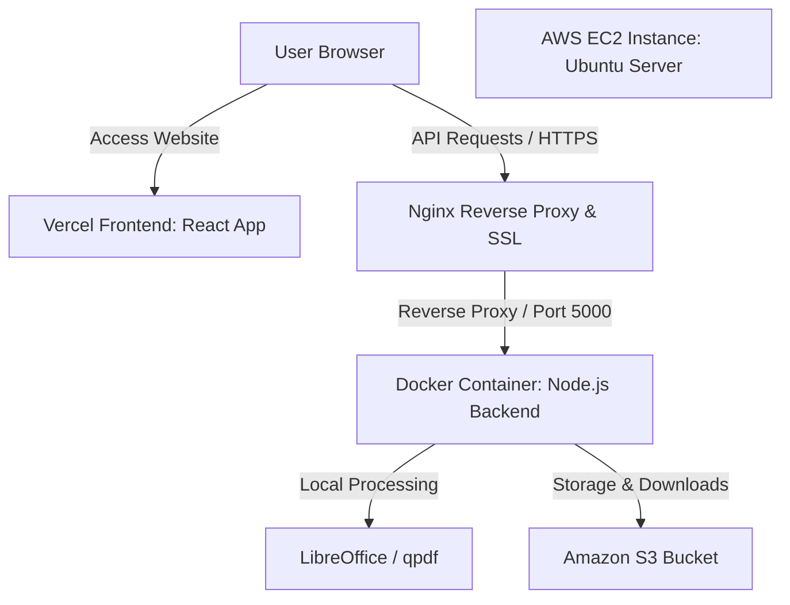

# Page Forge PDF Toolkit — Production Deployment Guide

This guide provides the complete step-by-step procedure to deploy the Page Forge PDF Toolkit in a production environment using **React (Vercel)**, **Express.js (Docker inside AWS EC2)**, **AWS S3 (Cloud Storage)**, **Nginx (Reverse Proxy with SSL)**, and **GitHub Actions (CI/CD)**.

---

## 1. Cloud Architecture



---

## 2. Step-by-Step Deployment Guide

### Phase 1: Amazon S3 & IAM Configuration
To store uploads and processed files securely:

1. **Create an S3 Bucket**:
   * Open the **AWS Console** and go to **S3** → **Create Bucket**.
   * Enter a unique bucket name (e.g., `page-forge-toolkit-storage`).
   * Select your preferred AWS Region (e.g., `us-east-1`).
   * Keep **"Block all public access"** checked (highly secure; our app will communicate using pre-signed URLs, meaning the bucket does not need to be public).
   * Click **Create Bucket**.

2. **Configure IAM Policy & Credentials**:
   * Navigate to **IAM** (Identity and Access Management) → **Policies** → **Create Policy**.
   * Switch to the **JSON** tab and paste the following policy (replace `page-forge-toolkit-storage` with your bucket name):
     ```json
     {
         "Version": "2012-10-17",
         "Statement": [
             {
                 "Effect": "Allow",
                 "Action": [
                     "s3:PutObject",
                     "s3:GetObject"
                 ],
                 "Resource": "arn:aws:s3:::page-forge-toolkit-storage/*"
             }
         ]
     }
     ```
   * Name the policy (e.g., `PageForgeS3Policy`) and click **Create**.
   * Go to **Users** → **Create User**. Name it `page-forge-app-user`.
   * Under **Permissions**, select **"Attach policies directly"** and search for `PageForgeS3Policy`. Check it and click next/create.
   * Open the newly created user, navigate to the **Security credentials** tab, scroll to **Access keys**, and click **Create Access Key**. Select **Application running outside AWS**, download the `.csv` file containing the `Access Key ID` and `Secret Access Key`, and save it securely.

---

### Phase 2: Launch and Configure AWS EC2

1. **Provision EC2 Instance**:
   * Go to **EC2 Console** → **Instances** → **Launch Instance**.
   * **OS**: Select **Ubuntu Server 22.04 LTS**.
   * **Instance Type**: Select `t3.small` or `t3.medium` (LibreOffice file conversions require at least 2GB of RAM).
   * **Key Pair**: Generate a new key pair (`.pem` format) and download it.
   * **Network Settings / Security Group**: Add inbound rules for:
     * **SSH (Port 22)**: Set source to "My IP" for safety.
     * **HTTP (Port 80)**: Set source to "Anywhere (`0.0.0.0/0`)".
     * **HTTPS (Port 443)**: Set source to "Anywhere (`0.0.0.0/0`)".
   * Click **Launch Instance**.

2. **Install Docker and Nginx on EC2**:
   Open a terminal on your computer, navigate to where your `.pem` key file is saved, and run:
   ```bash
   # Connect to your server (replace <ec2-ip> with your EC2 public IP)
   ssh -i "your-key.pem" ubuntu@<ec2-ip>
   ```
   Inside your Ubuntu EC2 terminal, execute:
   ```bash
   # Update packages
   sudo apt update && sudo apt upgrade -y

   # Install Docker
   sudo apt install docker.io -y
   sudo systemctl enable --now docker

   # Allow Ubuntu user to run Docker without sudo prefix
   sudo usermod -aG docker ubuntu

   # Log out and log back in to apply group permissions
   exit
   ssh -i "your-key.pem" ubuntu@<ec2-ip>

   # Install Nginx
   sudo apt install nginx -y
   sudo systemctl enable --now nginx
   ```

---

### Phase 3: Environment Variables & Nginx Setup

1. **Configure Environment Variables**:
   Create a `.env` file in the user directory on EC2:
   ```bash
   nano /home/ubuntu/.env
   ```
   Paste the following, filling in your S3 bucket and IAM credentials:
   ```env
   PORT=5000
   NODE_ENV=production
   AWS_ACCESS_KEY_ID=your_iam_access_key_id
   AWS_SECRET_ACCESS_KEY=your_iam_secret_access_key
   AWS_REGION=your_aws_region_e.g._us-east-1
   S3_BUCKET_NAME=your_s3_bucket_name
   ```
   *(`Ctrl+O` then `Enter` to save, `Ctrl+X` to exit)*.

2. **Setup Nginx reverse proxy**:
   Create a site configuration file:
   ```bash
   sudo nano /etc/nginx/sites-available/pageforge
   ```
   Paste the configuration block (replace `api.yourdomain.com` with your subdomain or public IP):
   ```nginx
   server {
       listen 80;
       server_name api.yourdomain.com;

       client_max_body_size 100M; # Permits large PDF uploads

       location / {
           proxy_pass http://127.0.0.1:5000;
           proxy_http_version 1.1;
           proxy_set_header Upgrade $http_upgrade;
           proxy_set_header Connection 'upgrade';
           proxy_set_header Host $host;
           proxy_cache_bypass $http_upgrade;
           proxy_set_header X-Real-IP $remote_addr;
           proxy_set_header X-Forwarded-For $proxy_add_x_forwarded_for;
           proxy_set_header X-Forwarded-Proto $scheme;
       }
   }
   ```
   Activate the website and reload Nginx:
   ```bash
   sudo ln -s /etc/nginx/sites-available/pageforge /etc/nginx/sites-enabled/
   sudo rm /etc/nginx/sites-enabled/default
   sudo nginx -t # Test syntax validity
   sudo systemctl restart nginx
   ```

3. **Install Let's Encrypt SSL (HTTPS)**:
   ```bash
   sudo apt install certbot python3-certbot-nginx -y
   sudo certbot --nginx -d api.yourdomain.com
   ```

---

### Phase 4: Configure GitHub Actions CI/CD Pipeline

To enable automatic building and deployment of your backend upon pushing to GitHub:

1. **Get your SSH Private Key**:
   * Open the `.pem` key file you downloaded from AWS on your local machine and copy the entire text.
2. **Add GitHub Secrets**:
   * Navigate to your **GitHub Repository** → **Settings** → **Secrets and variables** → **Actions** → **New repository secret**.
   * Add the following secrets:

   | Secret Name | Value |
   | :--- | :--- |
   | `DOCKER_USERNAME` | Your Docker Hub account username |
   | `DOCKER_PASSWORD` | Your Docker Hub account password or Access Token |
   | `EC2_HOST` | Your EC2 Domain (e.g. `api.yourdomain.com`) or public IP |
   | `EC2_USERNAME` | `ubuntu` |
   | `EC2_SSH_KEY` | Paste your complete `.pem` private key content |

3. **Push Code to GitHub**:
   * Push your changes to the primary branch (`main`).
   * The GitHub Actions CI/CD pipeline will automatically build the backend Docker container, push it to Docker Hub, pull the image on EC2, and restart the backend.

---

### Phase 5: Deploy Frontend to Vercel

1. Log in to [Vercel](https://vercel.com/) and link your GitHub account.
2. Select **Add New** → **Project** and select your repository.
3. Configure the build parameters:
   * **Framework Preset**: Vite
   * **Root Directory**: `frontend`
   * **Environment Variables**: Add `VITE_API_URL` set to your EC2 domain (e.g. `https://api.yourdomain.com`).
4. Click **Deploy**. Vercel will compile and host your React interface.

---

## 3. Maintenance Commands

Keep these commands handy for maintaining your server:

* **Check running container**:
  ```bash
  docker ps
  ```
* **View real-time application logs**:
  ```bash
  docker logs -f page-forge-backend
  ```
* **Restart the backend manually**:
  ```bash
  docker restart page-forge-backend
  ```
* **Inspect Nginx Server Logs**:
  ```bash
  sudo tail -f /var/log/nginx/error.log
  ```
